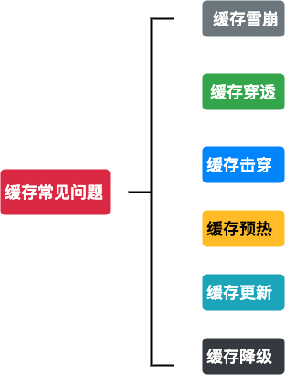

### 1、什么是缓存雪崩？

> 面试官：你能说一下什么是缓存雪崩吗？
>
> 我：雪崩啊，雪崩就是雪崩了！应该是这样、、、
>
> 面试官：纳尼？？？
>
> 我：缓存雪崩就是缓存和雪一起崩了，嗯，就这样
>
> 面试官：回去等通知吧！
>
> 我：额！不是的不是的不是这样的，客官请留步！
>
> 面试官：再给你一次机会，快说！！！
>
> 我：**缓存雪崩我是这样理解的：由于缓存在某一时刻全部失效，此时大量请求本该走缓存的都去查询数据库了，对数据库的CPU和内存都造成了巨大的压力，严重情况会造成数据库宕机，从而，发生一系列连锁反应，造成整个系统不可用；**
>
> 面试官：那你是怎么解决的。
>
> 我：解决方案有三：
>
> - **为key设置不同的过期时间**
> - **给每一个缓存数据增加相应的标记，记录缓存是否失效，如果缓存标记失效，则更新缓存数据。**
> - **一般并发量不是特别大的情况，加排队锁🔒**

### 2、什么是缓存穿透？

> 缓存穿透是指用户查询了数据库中本就不存在的数据，缓存中自然也木有，这就导致用户每次都在缓存中找不到，都要去数据库中查一遍，然后返回空（注意⚠️这就相当于两次无效查询），这就好像缓存失效了一样，请求直接绕过缓存直达数据库。
>
> 解决方案：
>
> - 布隆过滤器：将所有可能存在的数据哈希到一个足够大的bitmap中，一个一定不存在的数据会被布隆过滤器拦截掉，从而避免了对底层存储系统查询的压力。
> - 缓存空值：如果一个查询的数据返回空（不论是不存在还是系统故障），仍然把这个空结果缓存，但设定极短的过期时间，最长不超过五分钟，这样同样的请求进来在短时间内就不会透过缓存直达数据库了。

### 3、什么是缓存预热？

>  缓存预热就是系统上线后，将相关的缓存数据直接加载到混存系统中。用户直接查询事先预热到缓存中的数据，这样就避免用户在请求的时候，先访问数据库，再把数据加载到缓存的问题。

### 4、如何处理缓存更新？

> 缓存更新除了缓存系统自带的缓存淘汰策略之外（redis默认有6种淘汰策略），还可以根据具体的业务需求自定义缓存淘汰策略，常见的有两种：
>
> - 定时清理过期缓存
> - 当用户请求的时候，再去判断该缓存是否过期，过期则去数据库请求新的数据并更新缓存。

### 5、缓存降级是个啥？

> 当访问量剧增、服务出现问题(如响应时间慢或不响应)或非核心服务影响到核心流程的性能时，仍然 需要保证服务还是可用的，即使是有损服务。系统可以根据一些关键数据进行自动降级，也可以配置开 关实现人工降级。降级的最终目的是保证核心服务可用，即使是有损的。
>
> 降级的情况，就是缓存失效或者缓存服务挂掉的情况下，我们也不去访问数据库。我们直接访问内存部分数据缓存或者直接返回默认数据。
>
> 解决方案：
>
> - 设置二级缓存，同样的数据对应内存中也存一份，例如：guava、Caffeine

### 6、什么是缓存击穿？

> 在平常高并发的系统中，大量的请求同时查询一个key时，此时这个key正好失效了，就会导致大量的请求都打到数据库上面去。这种现象我们称为缓存击穿。
>
> 解决方案：
>
> - 互斥锁：只让一个线程构建缓存，其他线程等待构建缓存的线程执行完，重新从缓存获取数据就可以了。如果是单机，可以用synchronized或者lock来处理，如果是分布式环境可以用分布式锁就可以了（分布式锁，可以用memcache的add, redis的setnx, zookeeper的添加节点操作）。
>
> - “提前”使用互斥锁：在value内部设置1个超时值(timeout1), timeout1比实际的redis timeout(timeout2)小。当从cache读取到timeout1发现它已经过期时候，马上延长timeout1并重新设置到cache。然后再从数据库加载数据并设置到cache中。
>
> - 永远不过期：1）从redis上看，确实没有设置过期时间，这就保证了，不会出现热点key过期问题，也就是“物理”不过期。
>
>   2）从功能上看，如果不过期，那不就成静态的了吗？所以我们把过期时间存在key对应的value里，如果发现要过期了，通过一个后台的异步线程进行缓存的构建，也就是“逻辑”过期
>
> - 缓存屏障