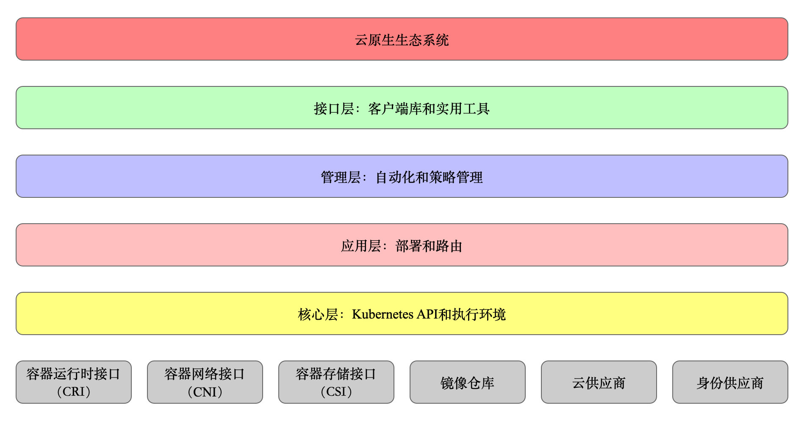

### 分层架构

Kubernetes 设计理念和功能其实就是一个类似 Linux 的分层架构，如下图所示

- 核心层：Kubernetes 最核心的功能，对外提供 API 构建高层的应用，对内提供插件式应用执行环境
- 应用层：部署（无状态应用、有状态应用、批处理任务、集群应用等）和路由（服务发现、DNS 解析等）
- 管理层：系统度量（如基础设施、容器和网络的度量），自动化（如自动扩展、动态 Provision 等）以及策略管理（RBAC、Quota、PSP、NetworkPolicy 等）
- 接口层：kubectl 命令行工具、客户端 SDK 以及集群联邦
- 生态系统：在接口层之上的庞大容器集群管理调度的生态系统，可以划分为两个范畴
  - Kubernetes 外部：日志、监控、配置管理、CI、CD、Workflow、FaaS、OTS 应用、ChatOps 等
  - Kubernetes 内部：CRI、CNI、CVI、镜像仓库、Cloud Provider、集群自身的配置和管理等

## 基本概念

| 概念                                    | 作用                                        | 备注                                                         |
| --------------------------------------- | ------------------------------------------- | ------------------------------------------------------------ |
| Cluster                                 | 超大计算机抽象，由节点组成                  |                                                              |
| Container                               | 应用运行在容器中                            |                                                              |
| Pod                                     | kubernetes基本调度单位                      | Pod 是 kubernetes 中你可以创建和部署的最小也是最简的单位。Pod 代表着集群中运行的进程。Pod 中可以共享两种资源：网络和存储。 |
| ReplicaSet                              | 创建和管理pod，支持无状态应用               |                                                              |
| Service                                 | 应用Pods的访问点，屏蔽IP寻址和负载均衡      |                                                              |
| Deployment                              | 管理ReplicaSet，支持滚动/灰度等高级发布机制 |                                                              |
| ConfigMap/Secrets                       | 应用配置/敏感数据配置                       |                                                              |
| DaemontSet                              | 保证每个节点有且仅有一个pod，常见于监控     |                                                              |
| StatefulSet                             | 类似于ReplicaSet，但支持有状态应用          |                                                              |
| Job                                     | 运行一次性任务                              |                                                              |
| CronJob                                 | 周期性运行的任务                            |                                                              |
| Volume                                  | 可装载磁盘文件存储                          |                                                              |
| PersistentVolume/PersistentVolumeClains | 超大存盘存储抽象和分配机制                  |                                                              |
| Label/Selector                          | 资源打标签和定位机制                        |                                                              |
| Namespace                               | 资源逻辑隔离机制                            |                                                              |
| Readiness Probe                         | 就绪探针，流量接入pod的判断依据             |                                                              |
| Liveness Probe                          | 存活探针，是否kill pod的判断依据            |                                                              |

## 节点网络

|              | 作用                                           | 实现                                  |
| ------------ | ---------------------------------------------- | ------------------------------------- |
| 节点网络     | Master/Worker节点之间网络互通                  | 路由器、交换机、网卡                  |
| Pod网络      | Pod之间互通                                    | 虚拟网卡、虚拟网桥、路由器            |
| Service网络  | 屏蔽Pod地址变化+负载均衡                       | Kube-proxy、Netfilter、apiserver、DNS |
| NodePort     | 将Service暴露在节点网路上                      | Kube-proxy+Netfilter                  |
| LoadBalancer | 将Service网络暴露在公网上+负载均衡             | 公有云LB+NodePort                     |
| Ingress      | 反向路由、安全、日志监控（类似反向代理or网关） | Nginx/Envoy                           |

pod与集群节点的自动伸缩？

横向扩容：通过设置ReplicationController、ReplicaSet、Deployment等可伸缩资源的replicas字段，来手动实现pod中应用的横向扩容。

纵向扩容：通过增加pod容器的资源请求和限制来纵向扩容pod。

# 开放接口

Kubernetes 作为云原生应用的基础调度平台，相当于云原生的操作系统，为了便于系统的扩展，Kubernetes 中开放的以下接口，可以分别对接不同的后端，来实现自己的业务逻辑：

- [容器运行时接口（CRI）](https://jimmysong.io/kubernetes-handbook/concepts/cri.html)：提供计算资源
- [容器网络接口（CNI）](https://jimmysong.io/kubernetes-handbook/concepts/cni.html)：提供网络资源
- [容器存储接口（CSI）](https://jimmysong.io/kubernetes-handbook/concepts/csi.html)，提供存储资源

以上三种资源相当于一个分布式操作系统的最基础的几种资源类型，而 Kuberentes 是将他们粘合在一起的纽带。

容器运行时接口（Container Runtime Interface），简称 CRI。

容器网络接口（Container Network Interface），简称 CNI。

容器存储接口（Container Storage Interface），简称 CSI。

|   类别   | 名称                                                         |
| :------: | ------------------------------------------------------------ |
| 资源对象 | Pod、ReplicaSet、ReplicationController、Deployment、StatefulSet、DaemonSet、Job、CronJob、HorizontalPodAutoscaling、Node、Namespace、Service、Ingress、Label、CustomResourceDefinition |
| 存储对象 | Volume、PersistentVolume、Secret、ConfigMap                  |
| 策略对象 | SecurityContext、ResourceQuota、LimitRange                   |
| 身份对象 | ServiceAccount、Role、ClusterRole                            |